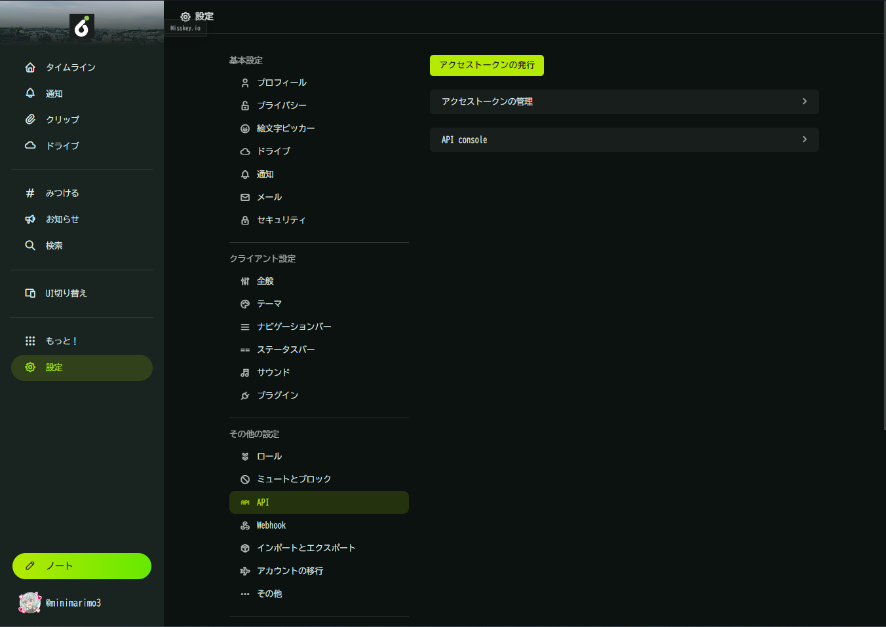
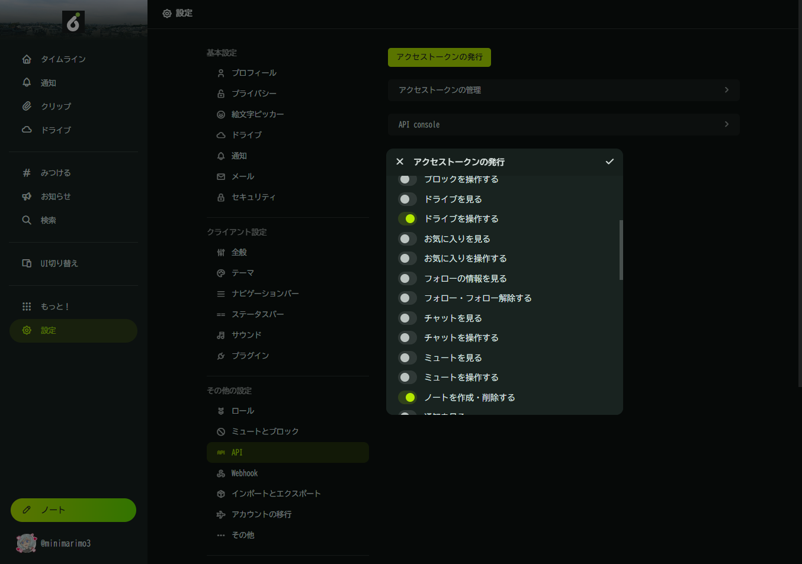
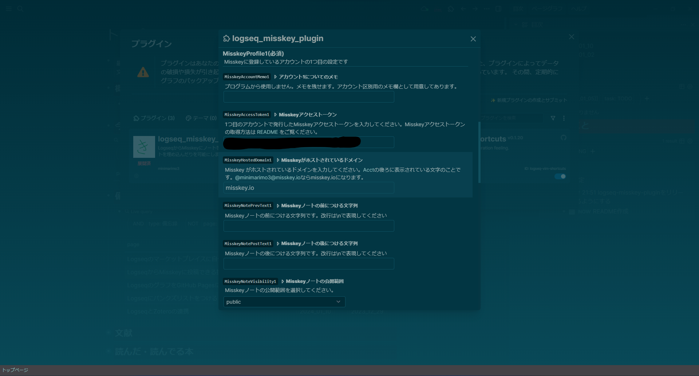

# Logseq Misskey Plugin

## 拡張機能の説明

ジャーナルすぐ書き忘れるのにノートはポンポン投稿してる。ならいっそLogseqからノート投稿できるようにしたらジャーナルが埋まるんじゃないかという考えで作られた拡張機能。Logseqに以下の機能を追加します。

1. 現在のカーソルにある文章と画像・動画をMisskeyへ投稿するコマンド(`現在のブロック(current)をmisskeyに投稿する`)
    
2. 現在のカーソルの子ブロックをブロックごとに別ノートとしてMisskeyへ投稿するコマンド(`子ブロック(children)をmisskeyに投稿する`)
3. LogseqからMisskeyで表示可能な投稿を引用状態で埋め込むコマンド。(`misskeyのノート(note)を埋め込む`)
    
4. その他ノート投稿時タグ付け、プロパティ削除など小さな機能
5. アカウント切り替え

Misskey v2023.12.2で動作確認しました。自分はioにいるので同じなら問題なく動きます。

## 設定方法

### Misskey側の設定

#### これは何をしてるの?

今からやることの説明なので不安な方は読んでください。

これからMisskeyのAPIキーというものを発行してもらいます。これは簡単に言うと特別なパスワードのようなもので、これがあるとLogseqの拡張機能があなたのMisskeyアカウントを操作する権限を与えられているとMisskey側から確認することができます。APIキーはログイン時に使用するID/パスワードと違い同時に複数個発行することができ、それぞれのキーごとに権限を細かく設定・無効化できるので比較的安全です。

この拡張機能は"ノートの作成・削除"(write:notes)権限と"ドライブの操作"(write:drive)権限を求めます。逆に言うと他人のブロック(write:blocks)やフォロー(write:following)などは権限不足で不可能です。より詳しく知りたい場合は [Misskey APIについて書かれたmisskey-hub.netのページ](https://misskey-hub.net/en/docs/for-developers/api/) や [権限の一覧があるmisskey-hub.netのページ](https://misskey-hub.net/en/docs/for-developers/api/permission/) などを確認してください。

#### 実際やること

1. Misskey Webの`設定`->`API`から`アクセストークンの発行`をクリック

2. `名前`を適当に設定する(私はLogseq Misskey Pluginとしています)
3. `権限`から`ドライブを操作する`と`ノートを作成・削除する`を選択する
    ※ "ドライブを操作する"権限は画像や動画などのアップロードに、"ノートを作成・削除する"権限はノートの作成に使用しています。
    
4. 右上のチェックマークを押す
5. `確認コード`の下にある英数字の羅列を他人から見られない場所に保存する  
    ※ この確認コードが悪意ある人間に使用されるとドライブに適当なファイルをアップロードされたりノートを作成・削除されるため安全な場所に保存してください。まあ他人から見られなければいいのでブラウザのメモ帳とかにでもコピペしておけばいいと思います。あとで貼り付けるのでスクショはやめたほうがいい。

### 拡張機能(Logseq)側の設定

1. 拡張機能のインストール後、`設定`を開くと`プラグイン設定`があるので左の`Misskey Plugin`を選択し、`MisskeyProfile1(必須)`までスクロール。
2. `MisskeyAccessToken1 ▹ Misskeyアクセストークン`に先ほどMisskeyからコピーした確認コードを貼り付けて、`MisskeyHostedDomain1 ▹ Misskeyがホストされているドメイン`に適切な情報を入れてください。

※ APIキー含む設定情報は"~/.logseq/settings/logseq-plugin-for-misskey.json"ファイルに保存されます。

以上で初期設定は終わりです。あとは好みで設定してください。

## そのうちやるかも

トゥートの埋め込み時に絵文字パースが入るせいで時間とかおかしくなるのの修正(show.user.instance.softwareName見ればいいと思うんだけど過去のバージョンどうなってるのか調べるの面倒)  
登録アカウント数の制限解除設定。起動時設定スキーマの生成ですぐ終わるけど別に困ってないし

## その他

連絡はGitHubか[@minimarimo3@misskey.io](https://misskey.io/@minimarimo3@misskey.io)までお願いします。

~~ジャーナルへの書き込みは増えたけどDOINGの消し忘れは... :otaku_cry:~~
